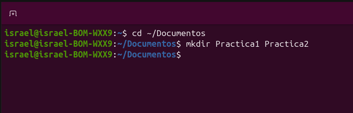
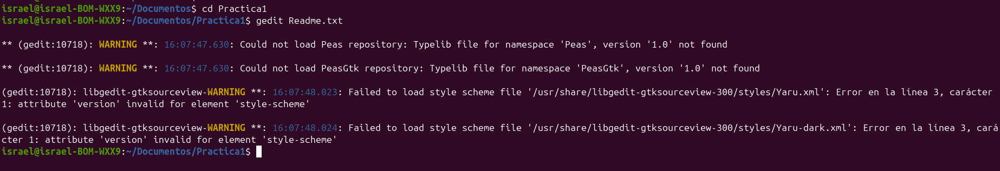
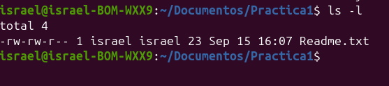
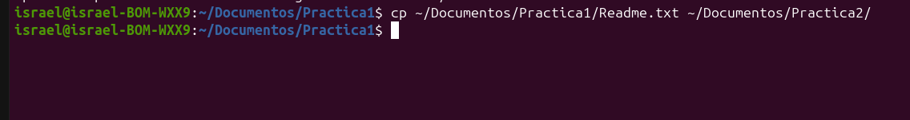
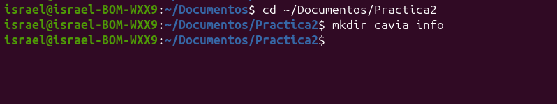
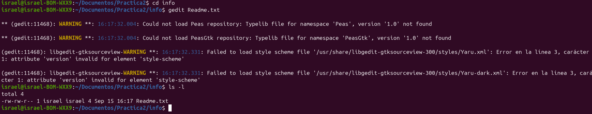
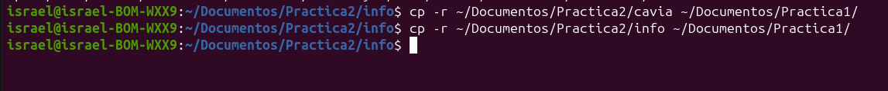
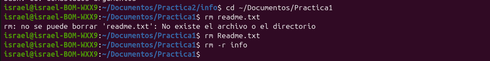

# 📌 Práctica: Comandos de Copia, Creación y Eliminación en Ubuntu

---

## 📖 Descripción
El objetivo de esta práctica es dominar los comandos fundamentales para la creación, gestión, duplicación recursiva y eliminación de archivos y carpetas directamente desde la terminal de Ubuntu.

---

## 🎯 Objetivos de aprendizaje
* Administrar archivos y carpetas en la consola de Ubuntu mediante `mkdir`, `gedit`, `cp` y `rm`.
* Comprender el uso del parámetro recursivo (`-r`) para manipular directorios completos.
* Reconocer el funcionamiento de las llamadas al sistema y la eliminación definitiva en disco sin papelera de reciclaje.

---

## 💻 Material utilizado
* Laptop con sistema operativo **Ubuntu Linux**
* Intérprete de comandos **GNU Bash**

---

## 📂 Jerarquía de Carpetas
* 📁 **[Codigo/](Codigo/)**: Script de automatización en Bash y comandos documentados.
* 📁 **[Terminal/](Terminal/)**: Capturas nítidas de la ejecución de comandos.
* 📁 **[Reporte/](Reporte/)**: Reporte formal en formato PDF con justificación técnica.

---

## ⚙️ Explicación Técnica de Comandos
* **`mkdir`**: Crea nuevas entradas de directorio en el sistema de archivos.
* **`cd`**: Cambia el directorio de trabajo activo (Current Working Directory).
* **`gedit`**: Editor de texto gráfico para generar y modificar archivos planos.
* **`ls -l`**: Lista entradas con detalles de inodo (permisos POSIX, dueño, tamaño y fecha).
* **`cp`**: Duplica archivos regulares de un origen a un destino.
* **`cp -r`**: Bandera recursiva que recorre el subárbol copiando carpetas y subcarpetas completas.
* **`rm`**: Desvincula el inodo del archivo, liberando los bloques de datos de forma inmediata.
* **`rm -r`**: Elimina directorios completos y su contenido de manera definitiva sin papelera de reciclaje.

---

## 📸 Evidencias de la Terminal

| | | |
|:---:|:---:|:---:|
|  1. Creación de directorios (`mkdir`) |  2. Creación de archivo (`gedit`) |  3. Guardado en disco |
|  4. Copiado de documento (`cp`) |  5. Carpetas en practica2 |  6. Archivo dentro de info |
|  7. Copia recursiva (`cp -r`) |  8. Borrado con `rm` y `rm -r` | 
---

## 📄 Reporte Formal
* 📎 [Descargar Reporte PDF](Reporte/practica.pdf)

---

## 💻 Código y Scripts
* 📜 [script.sh](Codigo/script.sh)

---

## 🎥 Video del funcionamiento
* ▶️ [Ver video en YouTube](PEGA_AQUI_EL_ENLACE_DE_TU_VIDEO)

---

## 💡 Conclusiones Técnicas
1. **Manejo de Recursividad:** En entornos tipo Unix, los directorios son tablas que contienen referencias a otros archivos. Operaciones estructurales como `cp` o `rm` exigen explícitamente el parámetro `-r` para recorrer el árbol jerárquico de inodos.
2. **Persistencia e Irreversibilidad:** A diferencia de las interfaces gráficas, la ejecución de `rm` a nivel de consola desasigna punteros de disco en tiempo real, careciendo de un buffer de recuperación (papelera), lo que demanda validación estricta previa a ejecutar órdenes destructivas.
